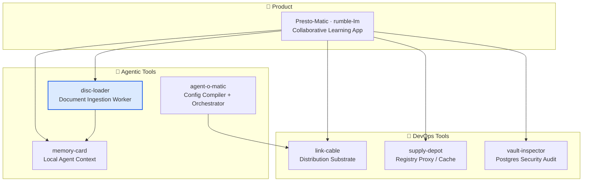

# disc-loader

> Sovereign rich-document ingestion worker/service — PDF, Office, OCR, HTML, and archives into canonical text and metadata, backed by [Xberg](https://github.com/xberg-io/xberg).

[](LICENSE)
[](https://www.rust-lang.org)
[](https://github.com/constantin-jais/disc-loader/actions/workflows/ci.yml)

> **Status:** `0.0.0` skeleton — boundary, upstream policy, and CI gates are explicit before implementation starts.

## Why it exists

Document parsers and OCR are high-blast-radius dependencies; they belong in an isolated worker, not in the product server hot path. `disc-loader` accepts documents, enforces resource limits, runs extraction, and returns structured output — without leaking parser internals into the calling service.

## Ecosystem



## Contract

| Direction  | Shape                                                         |
| ---------- | ------------------------------------------------------------- |
| **Input**  | Object-store key or uploaded bytes + declared MIME type       |
| **Output** | Canonical extracted text, metadata, extraction diagnostics    |
| **Limits** | Max bytes / pages / timeouts enforced before parser execution |

## Non-goals

- No direct dependency from `presto-server` to Xberg internals
- No remote LLM / OCR providers by default
- No silent best-effort ingestion without diagnostics

## Upstream

|               |                                                                                                            |
| ------------- | ---------------------------------------------------------------------------------------------------------- |
| **Project**   | [Xberg](https://github.com/xberg-io/xberg)                                                                 |
| **Policy**    | Upstream-first, pinned releases/commits, no permanent fork                                                 |
| **Fork rule** | Only for a blocking security/build/sovereignty patch; open the upstream PR and remove the fork once merged |

## Development

```bash
cargo fmt --all --check
cargo clippy --workspace --all-targets --all-features
cargo test --workspace --all-features
```

## Related projects

| Repo                                                                  | Role                                           |
| --------------------------------------------------------------------- | ---------------------------------------------- |
| [Presto-Matic](https://github.com/constantin-jais/Rumble-LM)          | Primary consumer — ingestion pipeline for RAG  |
| [memory-card](https://github.com/constantin-jais/memory-card)         | Receives extracted text as agent context input |
| [agent-o-matic](https://github.com/constantin-jais/Agent-O-Matic)     | Config compiler and autonomous orchestrator    |
| [link-cable](https://github.com/constantin-jais/link-cable)           | Multi-platform distribution substrate          |
| [supply-depot](https://github.com/constantin-jais/supply-depot)       | Sovereign registry proxy / cache               |
| [vault-inspector](https://github.com/constantin-jais/vault-inspector) | Postgres security audit                        |

## License

MIT © Constantin Jais
